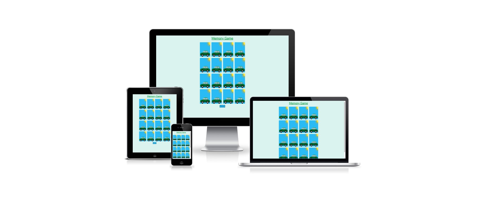
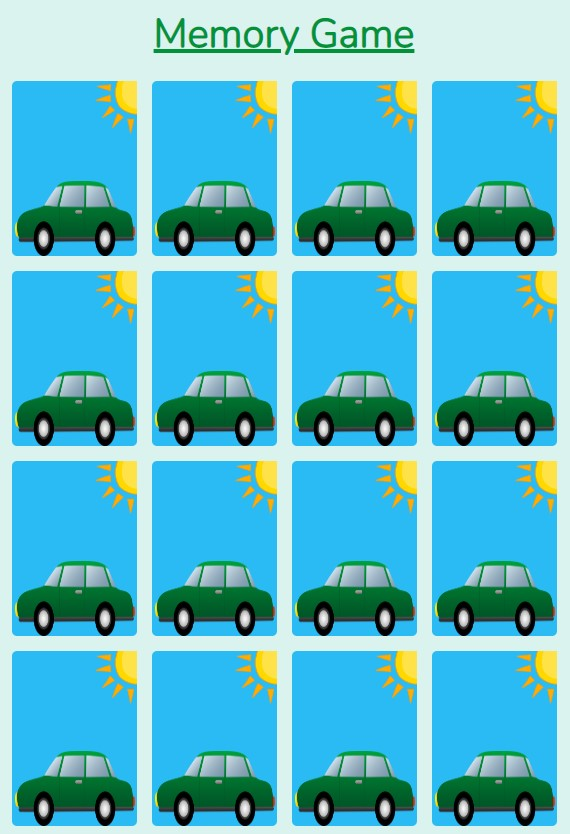
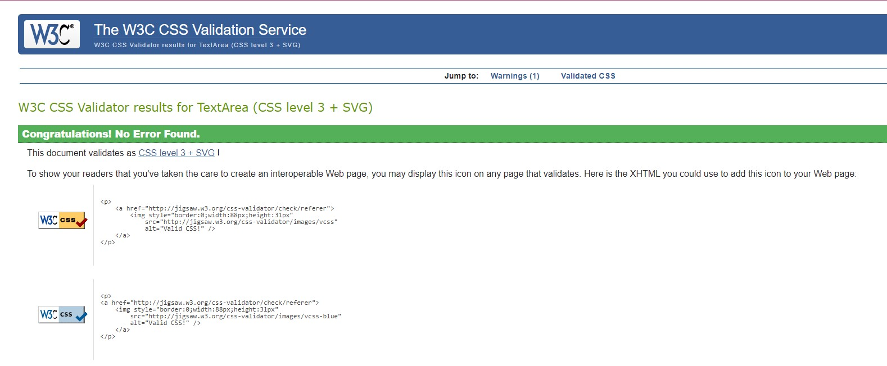
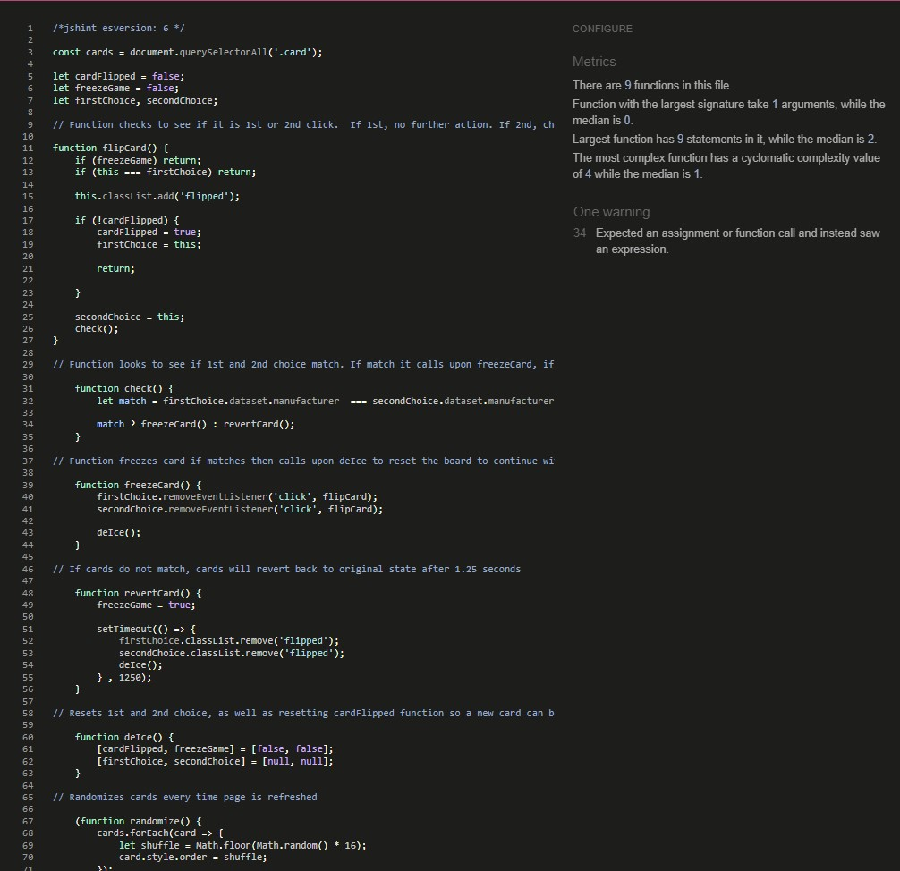
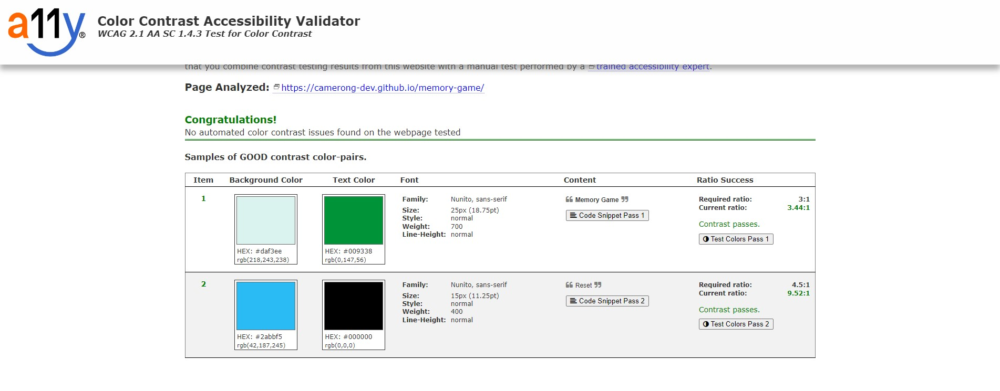

# Memory Game

Memory Game is a site that tests your memory by viewing cars and attempting to match them. 

## Live Site
[Memory Game](https://camerong-dev.github.io/memory-game/)

## Project Goals

- Build a front-end game with a simple UI for a user to interact with.

## Site Structure

Memory Game is a single page site, with the page consisting of a 4x4 grid containing logos of car manufacturers. 

## Colour Scheme

My colour scheme follows a basic palette of colours using greys and blues. I used [Colormind](http://colormind.io/) to generate random colour palettes to find a colour which stood out to me. From there I used [ColourSpace](https://mycolor.space/) to create a variety of colour palettes based of the intial colour.

Final Colour Palette:

## Fonts

The only font I used was imported into style.css from [google fonts](https://fonts.google.com/). Nunito was used for my h1 and button element for the simplistic appearance. Sans-serif was the backup due to the basic design, which would not seem out of place if it were present.

## Features

- 4x4 grid containing all cards for the game. Upon clicking a card, the card will flip over displaying the front side. 

- Reset button at the bottom of the page which allows the user to reset upon completing the game.

## Future Features

- Click to start game
- Timer starting at 90 seconds
- A running total of flipped cards
- You won / lost notification

## Testing

### HTML Validation Testing
  
  
  
### CSS Validation Testing

  
  
### JavaScript Validation Testing

  
  
### Colour Contrast Validation

  
 
## Responsiveness

Responsive design tests were carried out manually using Google Chrome's built in DevTools.

The following were tested:

  - iPhone 6/7/8/
  - iPhone 6/7/8 Plus
  - Samsung Galaxy S8+
  - Samsung Galaxy S20 Ultra
  - iPad Mini
  - Surface Pro 7 & Duo
  - Pixel 2
  - Nest Hub

## Deployment

The sit was deployed to GitHub pages.

### Deploy to GitHub Pages

  1. Navigate to the settings tab in the GitHub repository
  2. Once in settings, navigate to the pages tab on the left of the page
  3. Under source, select branch ‘master’ and then click ‘save’
  4. The page will now automatically refresh and show a detailed ribbon display to indicate deployment
  
  
  
### To create a Local Copy

   1. Under the repository name, click on the 'code' tab
  2. In your clone box, HTTPS tab, click on the clipboard icon
  3. In your IED open GitBash
  4. Chang the current working directory to the location you wish the cloned directory to be made
  5. Type 'git clone' and then paste the URL copied from GitHub
  6. Press enter and then the local clone will be created 
  
  
  
## Credits

  ### Media
  
    Images were found online from royalty free sources.
    
  ### Code 
  
    Followed tutorial for JavaScript code found [here] and modified to match my ID's and Classes (https://www.youtube.com/watch?v=ZniVgo8U7ek&t=1809s)
    Followed tutorial for HTML div layout and flip transition found [here](https://www.youtube.com/watch?v=28VfzEiJgy4&t=1561s)
    Image shaking animation taken from [here](https://www.w3schools.com/howto/howto_css_shake_image.asp)
    Help received debugging JavaScript from work colleagues 
