# Memory Game

Memory Game is a site that tests your memory by viewing cars and attempting to match them. 

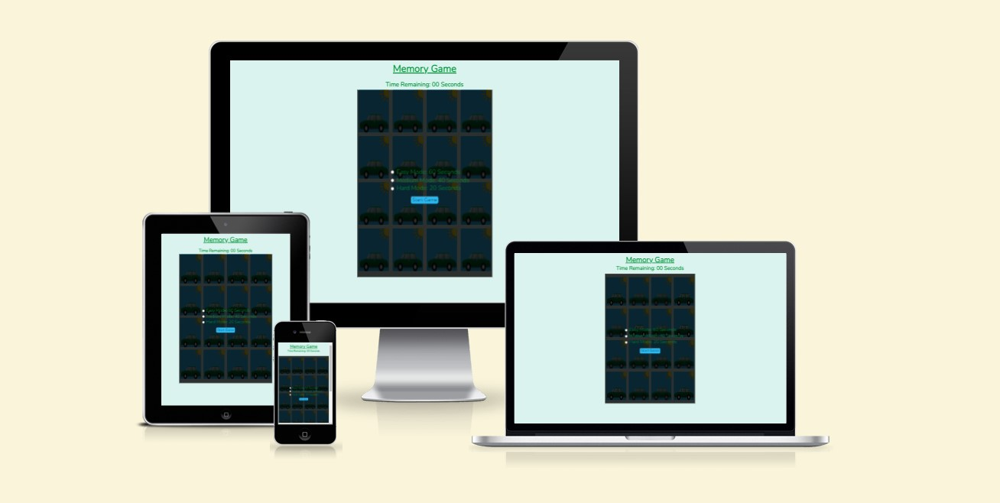

## Grade
Grade PASS

## Live Site
[Memory Game](https://camerong-dev.github.io/memory-game/)

## Project Goals

- Build a simple Memory Card game for users to easily interact with, with the user racing against the clock.  If time runs out they'll be notified and prompt to try again, but if they win they can see how many flips it took and how much time was left. 

## Site Structure

Memory Game is a single page site, with the page consisting of a 4x4 grid of cards and a timer. 

## Colour Scheme

My colour scheme follows a basic palette of colours using greys and blues. I used [Colormind](http://colormind.io/) to generate random colour palettes to find a colour which stood out to me. From there I used [ColourSpace](https://mycolor.space/) to create a variety of colour palettes based of the intial colour.

Final Colour Palette:

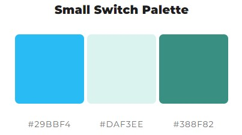

## Fonts

The only font I used was imported into style.css from [google fonts](https://fonts.google.com/). Nunito was used for all elements of my page for the simplistic and clean appearance. Sans-serif was the backup due to the basic design, which would not seem out of place if it were present.

## Features

### Start Screen

When user first loads or reloads the page they will be greeted with this overlay.  Here they will be able to select a mode, this will then dictate the time they'll have remaining to complete the game.  Once a mode has been selected the user will then press the 'Start' button to start playing.  If no mode is selected then it will automatically default to 'Easy Mode'.

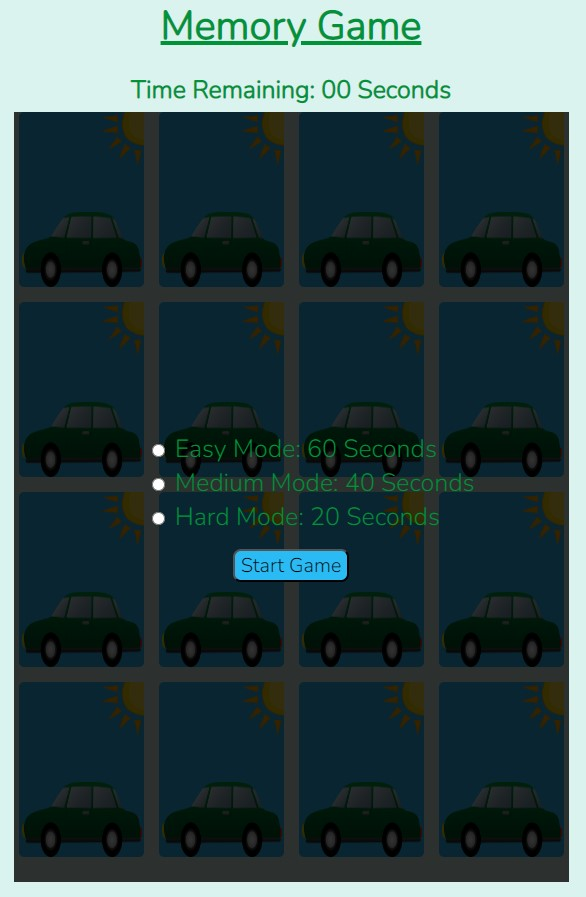

### Game Area

Once the user starts the game, they will see a 4x4 grid containing the cards.  On computers, hovering over a card will show a animation of the car shaking.  Selecting a card will cause it flip over showing the back side of the card.  The user will then be required to select another card, if matched they can flip another card straight away. Otherwise they will need to wait for the 2 cards to flip back over and then try again.

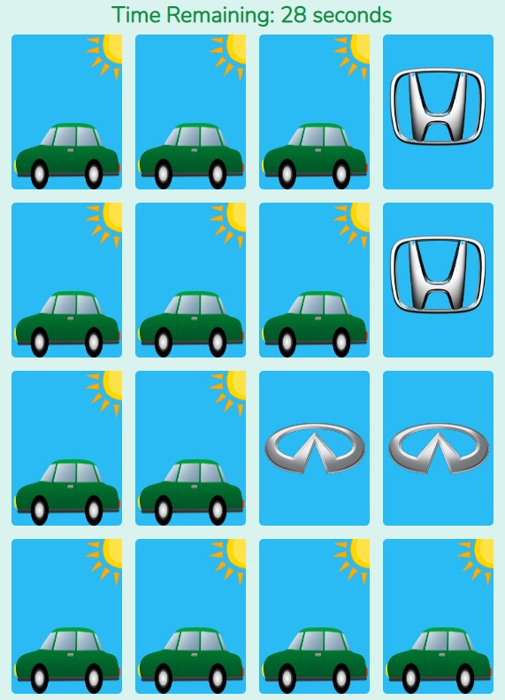

### Timer

The timer is a key part of this game as it shows the user how long they have left to complete the game.  Depending on what mode they selected before starting the game, they will start the countdown from either 60, 40 or 20 seconds. If the timer runs out the user loses and is notified via an overlay. 

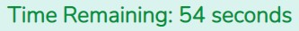

### Game Over Screen

If the user is unable to complete the game within the given time, an overlay will appear over the game area making it inaccessible.  The user is prompted to select 'Restart' to play the game again. 

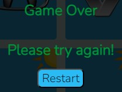

### Winner Screen

If the user completes the game within the given time, an overlay will appear over the game area making it inaccessible. The user is shown how many flips it took them to complete the game.  The timer is also frozen at the point of winning the game and is still shown above the game area.  The user is prompted to select the 'Play Again' button to play once more.

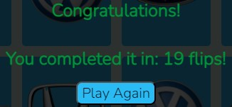

### Reset

During the game, if required the user can select the 'Reset' button found at the bottom of the page to restart the game and choose what mode they'd like to play.

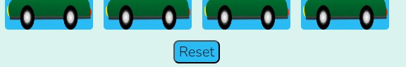

## Future Features

- A leaderboard of other users showing time taken and number of flips
- Ability for users to upload own images to be used on the cards instead

## Known Issues

- On mobile/tablet devices, after two cards have been selected and don't match. The last card will use the car animation as if the user was hovering over the card. It   is a minor cosmetic and does not affect any functionality of the game. 

## Testing

### HTML Validation Testing
  
  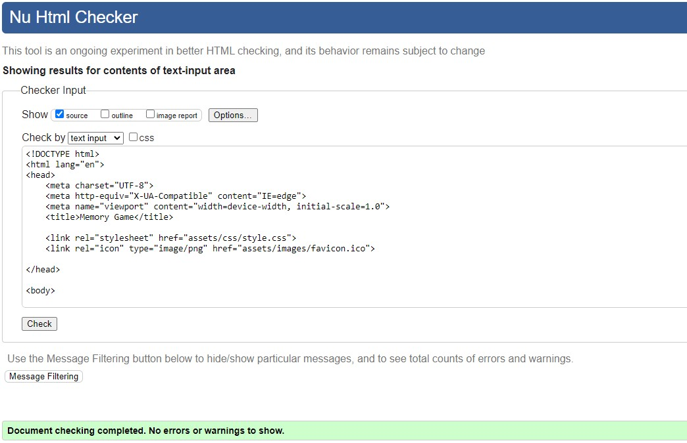
  
### CSS Validation Testing

  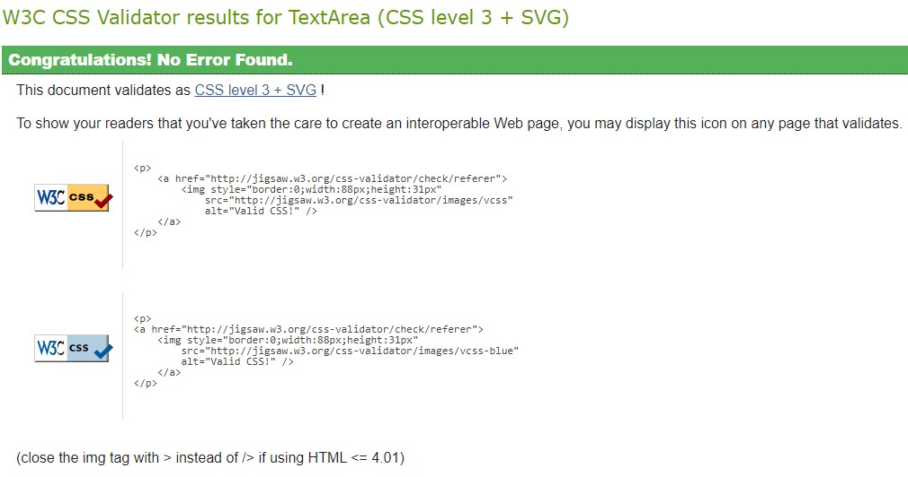
  
### JavaScript Validation Testing

  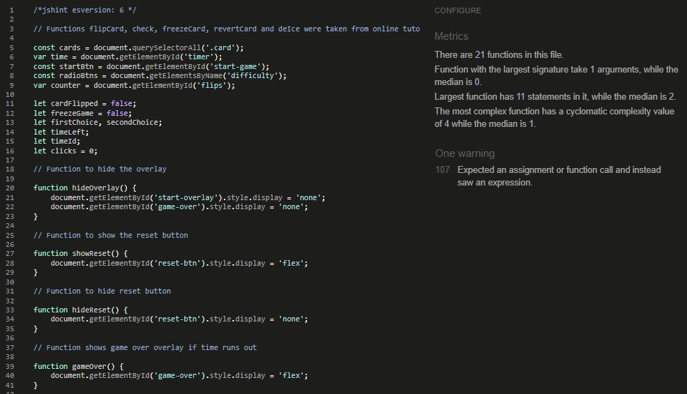
  
### Colour Contrast Validation

  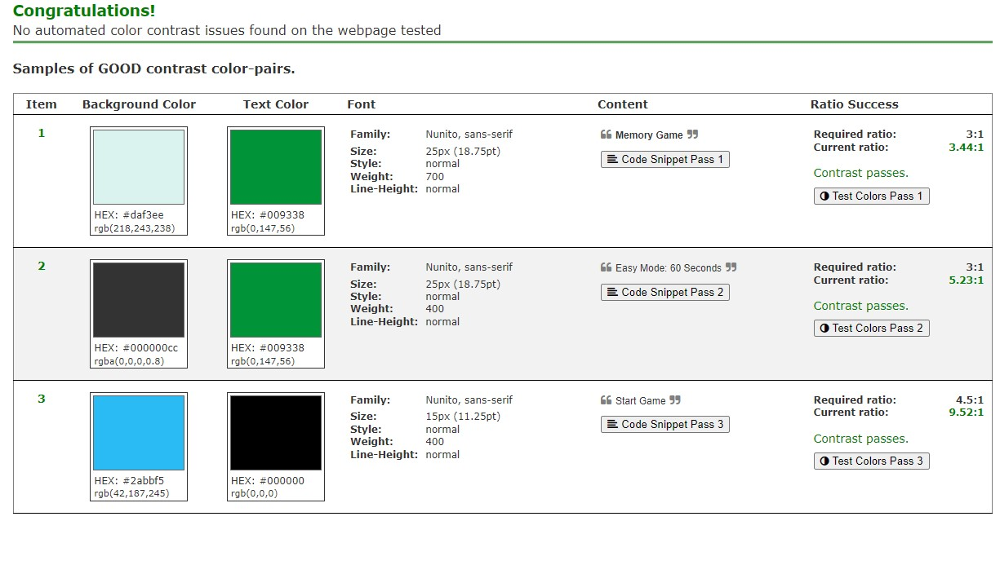
 
## Responsiveness

Responsive design tests were carried out manually using Google Chrome's built in DevTools.

The following were tested:

  - iPhone 6/7/8/XR/12 Pro
  - iPhone 6/7/8 Plus
  - Samsung Galaxy S8+
  - Samsung Galaxy S20 Ultra
  - iPad Mini
  - Surface Pro 7 & Duo
  - Pixel 2
  - Nest Hub

## Deployment

The sit was deployed to GitHub pages.

### Deploy to GitHub Pages

  1. Navigate to the settings tab in the GitHub repository
  2. Once in settings, navigate to the pages tab on the left of the page
  3. Under source, select branch ‘master’ and then click ‘save’
  4. The page will now automatically refresh and show a detailed ribbon display to indicate deployment
  
  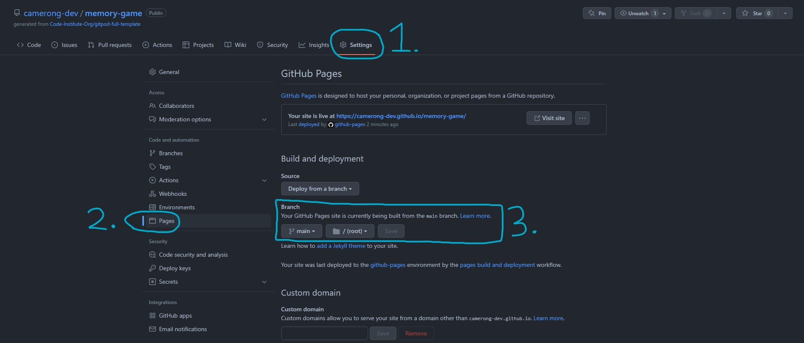
  
### To create a Local Copy

  1. Under the repository name, click on the 'code' tab
  2. In your clone box, HTTPS tab, click on the clipboard icon
  3. In your IED open GitBash
  4. Chang the current working directory to the location you wish the cloned directory to be made
  5. Type 'git clone' and then paste the URL copied from GitHub
  6. Press enter and then the local clone will be created 
  
  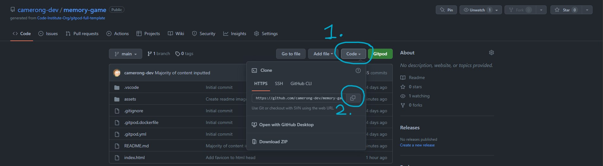
  
## Credits

  ### Media
  
   - Images were found online from royalty free sources.
    
  ### Code 
  
   - Followed tutorial for JavaScript core functions found [here](https://www.youtube.com/watch?v=ZniVgo8U7ek&t=1809s). Within JS file I comment which functions have        been taken from this tutorial.
   - Followed tutorial for HTML div layout and flip transition found [here](https://www.youtube.com/watch?v=28VfzEiJgy4&t=1561s)
   - Image shaking animation taken from [here](https://www.w3schools.com/howto/howto_css_shake_image.asp)
   - Help received debugging JavaScript from work colleagues 

  ### Resources 
  
   - [W3Schools](https://www.w3schools.com/js/default.asp)
   - [GeeksForGeeks](https://www.geeksforgeeks.org/javascript/?ref=shm)
   - [StackOverflow](https://stackoverflow.com/)
  
